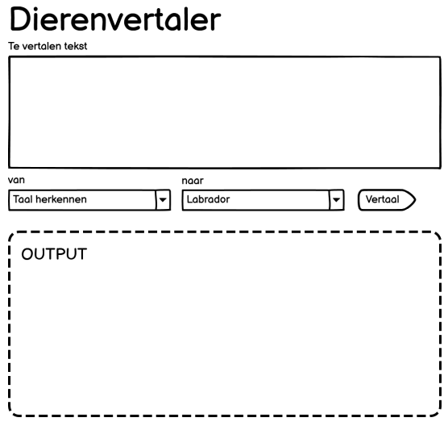
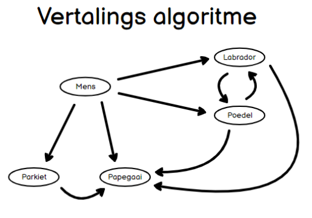

Goal
====

As mentioned in the README, the goal of this repository is to test PHP & DevOps skills.

# Case

As an animal friend, one would want to be able to communicate with his/her dear pets. For this, a translation
application is needed, to help them understand me and vice versa.

# Assignment

Create a REST API which can be used from the frontend to build the user stories (API-only; the UI itself is not
required, only supplied for context). Requirements are that it's built in PHP, you may use any framework of your choice.
The intent of this test is to gauge your OOP knowledge, this needs to be shown. Also keep in mind: error handling,
testing, pipelines and clean code. It's not necessary to work with a database, although it's allowed.

In the README, show us how to run the application and how to use the API. When the test is finished, upload it to a
public GitHub repository, to ensure that the work can be reviewed.

Good luck!

# User stories

## As a developer, I want to work with Docker in my local environment

Acceptance criteria:

* In the repository, instructions on how to run the local development environment are present.

## As DevOps engineer, I want to run the application with Docker in production.

Acceptance criteria:

* Production-ready Docker images must be present

## As a user, I want to translate input to a different (animal) language, to ensure communication between species

Acceptance criteria:

* A dropdown must be available for selection of the original language, and must contain: Human, Labrador, Poodle and
  Parakeet.
* The page must contain a textarea input where the to be translated string is entered, and it must contain at least one
  character.
* When the source language is Human, the possible target languages are: Labrador, Poodle, Parakeet, Parrot
* When the source language is Labrador, the possible target languages are: Poodle, Parrot
* When the source language is Poodle, the possible target languages are: Labrador, Parrot
* When the source language is Parakeet, the possible target languages are: Parrot
* When input is translated, algorithm is correctly applied, and the output is shown
* When Labrador is translated, each word is replaced by _woef_
* When Poodle is translated, each word is replaced by _woefie_
* When Parakeet is translated, each word starting with a vowel is replaced by _tjilp_, all other words are replaced by
  _piep_.
* When Parrot is translated, every sentence should start with _Ik praat je na: _, followed by the original text of that
  sentence.
* Input that is not recognized, or has incorrect syntax should trigger an error, e.g.: Labrador text with _woef waf_
  should trigger an error.
